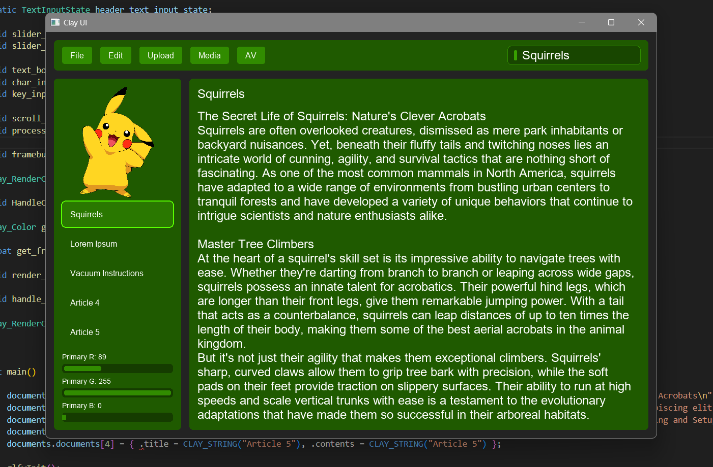

This is an OpenGL renderer for the C UI layout library [Clay](https://github.com/nicbarker/clay).  
An intended use case for this renderer is game UIs, both debugging and in game. Because it is entirely c and c++ no multi-language programming is required (if the game is written in c++), allowing for easy modification of game variables through the UI.  
Images can be loaded from disk by the renderer, or they can be passed in as OpenGL texture IDs allowing the user to update the image every frame.  
Freetype is used for character bitmap creation and kerning, allowing the user to use any font they choose.

Example UI generated using example.cpp:

  

To run the example first replace the CMAKE_TOOLCHAIN_FILE variable with the appropriate value for your setup.  
Then run the following commands:  
cmake --preset debug  
cmake --build build\debug -j  
cmake --build build\debug -  
build\debug\clay_example.exe  
Currently only been tested on Windows